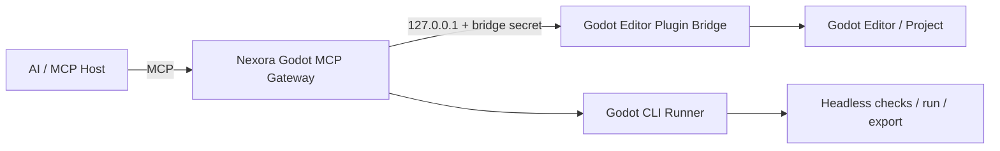

<div align="center">

# Nexora Godot MCP

### AI-native game development for Godot

A free, open-source and local-first MCP automation platform I designed to let AI systems work directly with Godot projects through structured, auditable and permission-aware operations.

[](LICENSE)
[](https://www.python.org/)
[](https://godotengine.org/)
[](https://modelcontextprotocol.io/)

[](https://docs.godotengine.org/)
[](https://dotnet.microsoft.com/)
[](https://github.com/features/actions)
[](https://openai.com/)
[](https://www.anthropic.com/)
[](https://ollama.com/)

[Vision](docs/PROJECT_VISION.md) · [Architecture](docs/ARCHITECTURE.md) · [Security](docs/SECURITY.md) · [Tool Catalog](docs/TOOL_CATALOG.md) · [Installer](docs/INSTALLER.md) · [AI Compatibility](docs/AI_COMPATIBILITY.md)

</div>

---

## Overview

I designed Nexora Godot MCP as a dedicated MCP server for Godot Engine. It is not an all-in-one MCP and it does not embed Nexora Forge or any other Nexora server.

Each MCP remains responsible for its own application:

```text
AI / MCP Host
   │
   ├── Nexora Forge MCP  → Blender
   │
   └── Nexora Godot MCP  → Godot
```

The AI host decides which MCP to call based on the task. If a prompt is about modeling, the host can choose Forge. If it is about scenes, scripts, gameplay, UI, debugging or exporting a Godot game, it can choose Godot MCP.

My goal is to let an AI participate in real Godot development instead of only explaining what the developer should click or type.

## Core principles

- **Dedicated:** Godot MCP controls Godot projects only.
- **Local-first:** the Godot editor and project remain on the user's machine.
- **Self-hosted:** users start and control their own MCP server.
- **Provider-agnostic:** the server does not depend on one AI vendor.
- **Local-model friendly:** any MCP-capable local AI host can use it.
- **Structured first:** normal work uses typed Godot operations instead of arbitrary shell or script execution.
- **Human controlled:** destructive or high-risk actions can require confirmation.
- **Auditable:** operations are logged without leaking secrets.
- **Workspace confined:** file operations remain inside approved project roots.
- **Free and open source:** no mandatory Nexora subscription or hosted account.

---

## What it is designed to do

| Area | Planned capability |
| --- | --- |
| Projects | inspect, create, open, import, settings, feature detection |
| Scenes | create, open, save, duplicate, instance, inspect scene tree |
| Nodes | create, delete, rename, reparent, transform, configure properties |
| Resources | load, create, duplicate, save, inspect dependencies |
| Scripts | create/edit GDScript and C#, parse/check, attach/detach |
| Signals | inspect, connect, disconnect, validate |
| UI | Control hierarchy, anchors, containers, themes, HUDs, menus |
| 2D | sprites, tilemaps, cameras, physics, animation |
| 3D | Node3D, MeshInstance3D, collision, cameras, lights, environments |
| Animation | AnimationPlayer, AnimationTree, tracks, state machines |
| Input | Input Map actions and event bindings |
| Physics | bodies, areas, collision layers/masks, shapes |
| Navigation | navigation maps, regions, agents, links |
| Audio | buses, players, streams, routing and volume |
| Shaders | create/edit shader resources and materials |
| Assets | inspect/import/reimport resources and dependencies |
| Runtime | run project/scene, stop, collect stdout/stderr |
| Debugging | parse errors, runtime errors, warnings, debugger summaries |
| Testing | smoke tests, headless runs, assertions, scene validation |
| Screenshots | capture game/editor previews for AI inspection |
| Performance | FPS/frame timing/basic profiler snapshots where available |
| Export | inspect presets, debug/release export, APK/desktop/web output |
| Batch | execute validated multi-step Godot operations |

See [docs/TOOL_CATALOG.md](docs/TOOL_CATALOG.md) for the proposed MCP surface.

---

## Architecture



The Python gateway owns authentication, permissions, path confinement, auditing and the public MCP tool surface.

The Godot editor plugin owns editor-only operations. It stays bound to `127.0.0.1` and processes structured requests on the editor thread.

The CLI runner handles operations Godot already exposes safely through its command line, such as import, parse/check, headless execution and export.

---

## AI compatibility

Nexora Godot MCP does not contain a built-in dependency on GPT, Claude, Grok, DeepSeek or any local model.

Instead, it exposes an MCP server that any compatible host can call.

```text
OpenAI API / ChatGPT-compatible host ─┐
Anthropic-compatible host            ├── MCP client → Nexora Godot MCP
Local AI host                        ┤
Custom agent framework               ┘
```

The model or host chooses the MCP; Nexora Godot MCP only performs validated Godot work.

---

## Security model

The default profile allows structured project editing while blocking unrestricted operating-system commands and arbitrary code execution.

| Profile | Intended behavior |
| --- | --- |
| `safe` | project inspection, logs, resources and non-mutating tools |
| `standard` | structured Godot edits inside the configured project; default |
| `unrestricted` | optional advanced scripting/command execution behind explicit gates |

Important controls:

- editor bridge fixed to loopback;
- separate MCP and bridge secrets;
- project-root confinement;
- path normalization on both sides;
- confirmation for destructive operations;
- allowlisted Godot CLI commands;
- unrestricted script/shell execution disabled by default;
- sanitized JSONL audit log.

---

## Target installation experience

```bash
nexora-godot setup
nexora-godot start
nexora-godot doctor
```

Planned lifecycle commands:

```text
nexora-godot setup
nexora-godot start
nexora-godot stop
nexora-godot status
nexora-godot doctor
nexora-godot update
nexora-godot project add
nexora-godot project list
nexora-godot logs
```

---

## Repository structure

```text
.
├── apps/web/                       # optional local control center
├── godot_addon/
│   └── addons/nexora_godot_mcp/   # EditorPlugin + localhost bridge
├── src/nexora_godot_mcp/          # Python MCP gateway
├── scripts/                        # installer/start helpers
├── docs/                           # project documentation
├── examples/                       # MCP host examples
├── tests/                          # gateway/security/tool tests
└── .github/workflows/              # CI
```

---

## Documentation

- [Project vision](docs/PROJECT_VISION.md)
- [Architecture](docs/ARCHITECTURE.md)
- [Security](docs/SECURITY.md)
- [Tool catalog](docs/TOOL_CATALOG.md)
- [Godot editor plugin](docs/GODOT_PLUGIN.md)
- [Installer](docs/INSTALLER.md)
- [AI compatibility](docs/AI_COMPATIBILITY.md)
- [Local models](docs/LOCAL_MODELS.md)
- [Workflows](docs/WORKFLOWS.md)
- [Web design](docs/WEB_DESIGN.md)
- [Roadmap](docs/ROADMAP.md)
- [Contributing](docs/CONTRIBUTING.md)

---

## Credits & contact

**Owner / Maintainer:** [Ghost Developer](https://github.com/Gh0stDeveloper)  
**Email:** [ghostnexora@gmail.com](mailto:ghostnexora@gmail.com)  
**Telegram:** [@Gh0stDeveloper](https://t.me/Gh0stDeveloper)

---

## License

Nexora Godot MCP is released under the [MIT License](LICENSE).

<div align="center">

**Nexora Godot MCP — AI-native game development for Godot.**

</div>
