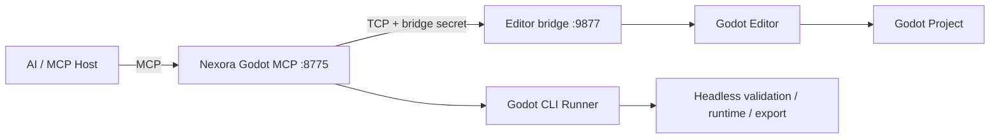

# Architecture

## Overview

Nexora Godot MCP separates the network-facing MCP gateway from the Godot editor.



The Godot editor is never the public MCP server.

## 1. Python MCP gateway

Package:

```text
src/nexora_godot_mcp/
```

Responsibilities:

- Streamable HTTP MCP surface;
- tool schemas and descriptions;
- local/static/OAuth authentication modes;
- permission profiles;
- DNS rebinding protection;
- project-root path confinement;
- bridge authentication;
- allowlisted Godot CLI invocation;
- managed runtime handles;
- export handling;
- sanitized audit records.

Default endpoint:

```text
http://127.0.0.1:8775/mcp
```

## 2. Godot editor bridge

Addon:

```text
godot_addon/addons/nexora_godot_mcp/
├── plugin.cfg
├── plugin.gd
└── bridge_server.gd
```

The bridge binds only to:

```text
127.0.0.1:9877
```

It is not an MCP implementation. It accepts a small newline-delimited JSON protocol from the local Python gateway.

Request:

```json
{
  "request_id": "uuid",
  "secret": "independent-bridge-secret",
  "operation": "scene.snapshot",
  "params": {}
}
```

Response:

```json
{
  "request_id": "uuid",
  "ok": true,
  "result": {}
}
```

The bridge validates the secret independently from MCP gateway authentication.

## 3. Current editor operation surface

Phase A implements:

```text
system.status
scene.snapshot
scene.open
scene.save
scene.create
node.create
node.set_properties
node.delete
batch.execute
```

The plugin executes these operations from the editor plugin lifecycle, keeping editor-specific work inside Godot.

## 4. Godot CLI runner

Godot already provides a documented command-line surface for operations that do not need direct editor manipulation.

The Python runner constructs commands itself. User-facing tools never receive an arbitrary shell string.

Current examples:

```text
godot --version
godot --headless --path <project> --editor --quit-after 1
godot --headless --path <project> --import
godot --path <project> [--scene <scene>]
godot --headless --path <project> --export-debug <preset> <output>
godot --headless --path <project> --export-release <preset> <output>
godot --headless --path <project> --export-pack <preset> <output>
```

## 5. Managed runtime handles

A game run is not tied to hidden MCP transport state.

```text
project_run
   ↓
run_8d13...
   ├── runtime_status
   ├── runtime_logs
   └── runtime_stop
```

The gateway tracks:

- process ID;
- command;
- start time;
- bounded stdout;
- bounded stderr;
- exit status.

This also makes the design usable with stateless Streamable HTTP.

## 6. Project confinement

Phase A configures one explicit project root using:

```env
NEXORA_GODOT_PROJECT_ROOT=/path/to/MyGame
```

Source, scene and export paths are resolved beneath that root.

A future project registry will allow several explicitly registered roots without enabling arbitrary filesystem access.

## 7. MCP authentication

### local

Loopback-only gateway for a trusted local MCP host.

### static

Strong bearer token for private direct clients.

### oauth

OAuth 2.1 resource-server mode with RFC 7662 token introspection and Godot-specific scopes.

Current normal scopes:

```text
godot:read
godot:write
```

A future unrestricted editor-script capability additionally uses:

```text
godot:script
```

## 8. Trust boundaries

| Boundary | Exposure | Protection |
| --- | --- | --- |
| MCP gateway | local/private/authorized remote | auth mode + transport security |
| Godot editor bridge | loopback only | independent bridge secret |
| Project files | configured project only | normalized path confinement |
| Godot CLI | local process | fixed allowlisted argument construction |
| Runtime processes | child processes | explicit run IDs |
| Audit log | local file | secret sanitization |

## 9. Why Forge is not embedded

Godot and Blender have different execution models and security boundaries.

Forge owns Blender workflows.

Godot MCP owns Godot workflows.

Keeping them separate produces clearer tools, smaller privilege sets, easier auditing and better AI tool selection.
